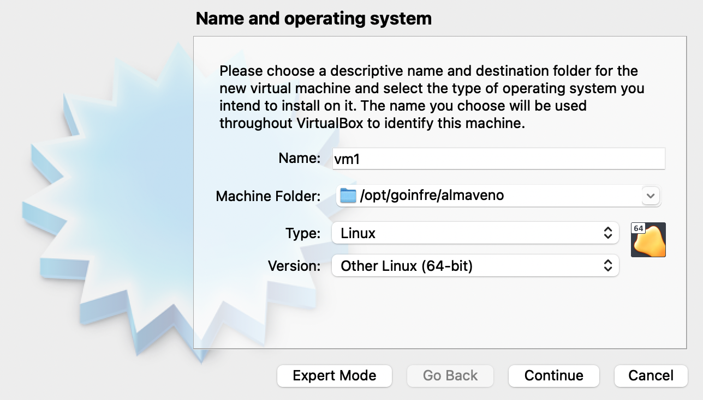
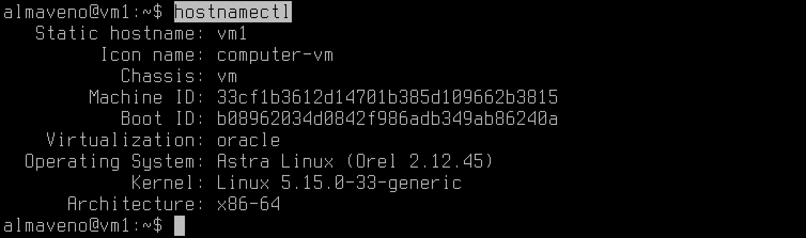
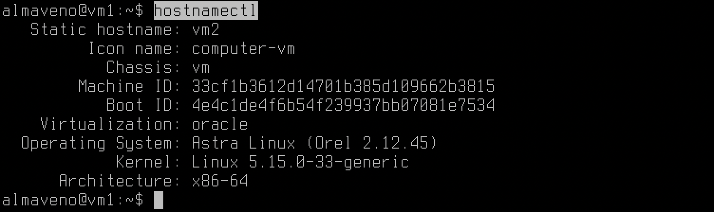

# Astra-Linux-virtualization

Выполнение кейса 4 CaseLab Support Greenatom

## Contents

оглавление
1
1ю1
1ю2
2
2ю1

## Part 1. Подготовка стенда. 

**== Task 1. Установка **ASTRA LINUX COMMON EDITION** ==**

##### Скачиваем образ диска с сайта **https://mirrors.edge.kernel.org/astra/stable/2.12_x86-64/iso/** (он будет в формате iso)
##### Поднимаем виртуальную машину (далее -- vm1)
 *vm1* 
##### Устанавливаем операционную систему
##### клонируем
 *vm2* 
##### При настройке сети выбрать подключение к внешней сети через соединение NAT network;
##### проверяем hostname у каждой виртульной машины с помощью команды `hostnamectl`
##### у vm1 она правильная 
 *vm2* 
##### у  vm2   она скопировалать из первой поэтому с помощью команды `hostnamectl set-hostname` меняем hostname на vm2**
 *vm2* 
Установка Salt
Следующие действия необходимо выполнить как Master-сервере, так и на управляемых узлах.

Для начала необходимо импортировать ключ репозитория:

wget -O -

https://repo.saltstack.com/py3/ubuntu/18.04/amd64/latest/SALTSTACK-GPG-KEY.pub | sudo apt-key add -

Затем необходимо добавить репозиторий с помощью следующей команды:

echo "deb http://repo.saltstack.com/py3/ubuntu/18.04/amd64/latest bionic main" | sudo tee /etc/apt/sources.list.d/saltstack.list

Обновите список системных пакетов:

sudo apt update

Установите пакеты Salt, для Master:

sudo apt -y install salt-api salt-cloud salt-master salt-ssh salt-syndic

для Minion:

sudo apt -y install salt-minion

Откройте следующие порты, чтобы компоненты могли взаимодействовать по сети:

sudo ufw allow proto tcp from any to any port 4505,4506
 

