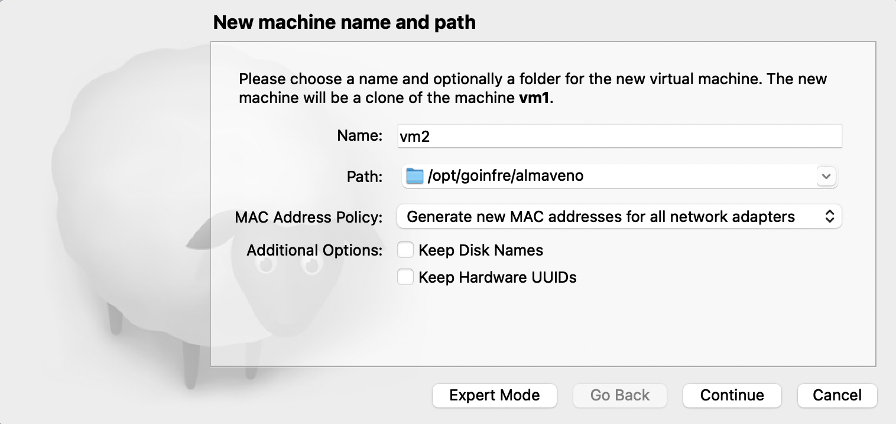

# Astra-Linux-virtualization

### Выполнение кейса CaseLab Support Greenatom

## Contents

1. [Подготовка стенда](#part-1-подготовка-стенда)
2. [Написание скриптов](#part-2-написание-скриптов)
---

## Part 1. Подготовка стенда. 

**== Task 1. Установка **ASTRA LINUX COMMON EDITION** ==**

##### Скачиваем образ диска с сайта **https://mirrors.edge.kernel.org/astra/stable/2.12_x86-64/iso/** (он будет в формате iso)
##### Поднимаем виртуальную машину (далее -- vm1) для этого будем испоользовать гипервизор virtualbox
 *vm1* 
##### Устанавливаем операционную систему
##### Клонируем
 *vm2* 
##### При настройке сети выбираем подключение к внешней сети через соединение NAT network;
##### Проверяем hostname у каждой виртульной машины с помощью команды `hostname`, они должны различаться
##### Удостоверяемся что каждая машина имеет свой отличительный ip с помощью команды `hostname -I`
 *vm1* 
 *vm2* 
##### Объединяем машины в сеть, для этого редактируем файл */etc/network/interfaces*, добавив туда *ip* машины, которая должна пинговаться.

**== Task 2. Установка **Saltstack** ==**

>Salt – это платформа с открытым исходным кодом для управления инфраструктурой, построена на динамической коммуникационной шине. Salt может использоваться для управления конфигурацией для любого набора систем или приложений, для управления данными, для удаленного запуска команд и т.д

##### Устанавливаем Saltstack.
##### Открываем порты, чтобы компоненты могли взаимодействовать по сети:  
`sudo ufw allow proto tcp from any to any port 4505,4506`
#### Дальше настраиваем Salt Master

> Salt Master – это сервер, который выступает в качестве центра управления для своих миньонов, именно от Master отправляются запросы на удаленное выполнение команд.

##### Редактируем файл */etc/salt/master*: добавляем в него IP-адрес сервера, у нас это vm2
`interface: 10.0.3.15`
##### Перезагружаем службу:
`/etc/init.d/salt-master restart`
##### Выводим на экран главный ключ, который необходим для подключения управляемых узлов, выполнив следующую команду:
`salt-key -F master`
 
 *vm2* 
#### Теперь нужно настроить Salt Minion

>Salt Minions – это серверы под управлением мастера, именно на них запускаются приложения и сервисы. Каждому миньону присваивается идентификатор, а мастер может ссылаться на этот идентификатор для назначения команд конкретным миньонам.

##### Редактируем файл */etc/hosts*: добавляем в него IP-адрес Master Salt, у нас это vm2
`10.0.3.15 salt`
##### В файле конфигурации ноды */etc/salt/minion* в директиву *master_finger* вставляем скопированный ключ *master.pub*
##### Выполняем перезагрузку службы:
`/etc/init.d/salt-minion restart`

На виртуальной машине 2 принимаем ключ:  
`salt-key --accept='vm1'`
 
 *vm2* 
Проверяем связь между Мастером и Миньоном, выполнив команду: 
`salt ubuntu-sys test.ping`
 
 *vm2* 

---

## Part 2. Написание скриптов. 

> NGINX — это веб-сервер и почтовый прокси, который работает под управлением операционных систем семейства Linux/Unix и Microsoft
##### Скачиваем дистрибутив nginx в папку системы с Saltstack master.

**== Task 1. Передача файла дистрибутива nginx ==**
##### Нужно передать файл дистрибутива nginx в папку */tmp* на *vm1* средствами Saltstack.
##### Для написания скриптов будем пользоваться командной оболочкой *bash*
##### Можно было бы скачать и установить NGINX на миньон одной командой с мастера:
`salt 'vm1' pkg.install nginx`
##### Но мы будем использовать скрипт
*[nginx_replase.sh](nginx_replase.sh)*
##### Скрипт запускается из домашней директории, он берет на вход один аргумент с именем миньона, на который нужно переместить дистрибутив.
##### Для скорости отправки дистрибутив передается в сжатом формате.

 *Вывод* 
 *Вывод* 

**== Task 2. Установка nginx ==**

##### Теперь nginx нужно установить. Скрипт *[nginx_install.sh](nginx_install.sh)* также запускается из домашней директории и берет на вход один аргумент с именем миньона.
##### Скрипт устанавливает, настраивает и запускает nginx.
 *Вывод* 
 *Вывод* 
##### Проверяем, nginx действительно установился и запустился.
 *Вывод* 

**== Task 3. Замена тестовой веб-страницы ==**
 
##### Вывод подтвердил, что служба успешно запущена. Однако лучше всего протестировать ее запуск посредством запроса страницы из Nginx.
`curl -4 localhost`
##### После запуска команды открывается приветственная страница со словами "Welcome to nginx!"
 *vm1* 
##### Но было бы интереснее если бы при открытии показывалось “Hello Greenatom”. Для этого будем использовать скрипт *[nginx_webpage.sh](nginx_webpage.sh)*
 *Вывод* 
##### Проверяем
 *vm1* 
##### 
